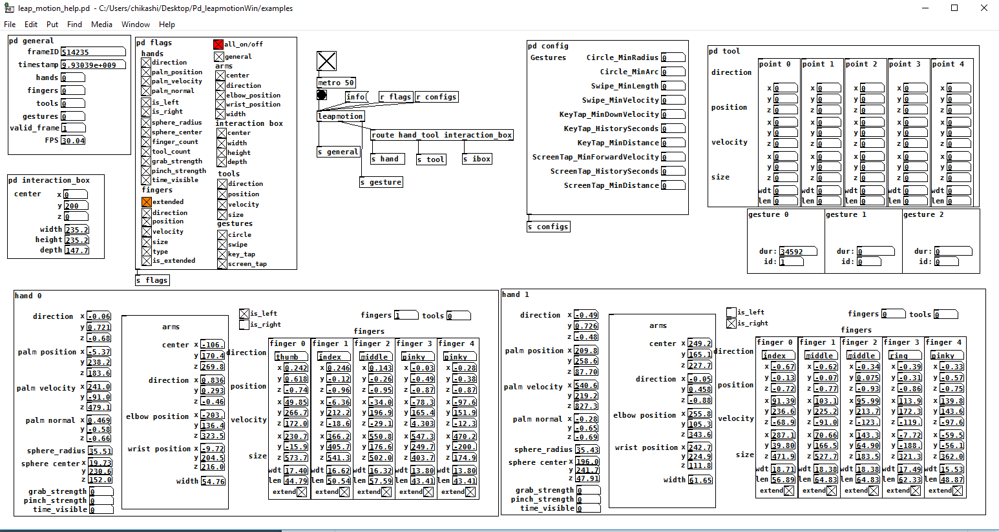

## Leapmotion object
A pure data external object for Leapmotion v.2



- Commissioned by [João Pais](https://www.facebook.com/jmmmpais)
- Developed by [Dr. Chikashi Miyama](http://chikashi.net)
- Thanks to: [Dan Wilcox](https://github.com/danomatika) and [Jakub Valtar](https://github.com/JakubValtar)

## how to use
In the examples folder you can find the help patch, as well as the files leapmotion.dll and leap.dll. Always place both dlls in Pure Data's path, or in the same folder as your patch, to instantiate the leapmotion object and the communication to the leap sensor.

## how to build
### prerequisite
- Visual Studio 2015
- [Leap SDK](https://developer.leapmotion.com/documentation/v2/cpp/index.html)
- [flext](https://github.com/grrrr/flext) by Thomas Grill
- pthread
- [pure data for windows](http://puredata.info/downloads/pure-data)

Flext enables a C++-based Pd-external development and it must be built first.

pure data for windows should be .zip version, extract it and place it under your home directory.
clone the repo and submodules
```
git clone --recursive git://github.com/foo/bar.git
```
download LeapSDK and place it in the root directory of the repo.

open command line by Start -> Run -> cmd and find folder that contains **vcvars32.bat** and run. This is necessary to run msvc( micro soft visual C++ compiler).

vcvars32.bat can be found C:\Program Files (x86)\Microsoft Visual Studio 14.0\VC\bin

back to the cloned repo.
```
cd flext
build pd msvc
```
this generates error but it's normal.
open Open flext\buildsys\config-win-pd-msvc.txt

First of all add following line and define the path to cloned repo.
```
PDPATH=*C:\to\your\downloaded\pd*
ROOTPATH=*C:\to\your\cloned\repo*
```
and edit the corresponding lines

```
PTHREADSVERSION=2
PTHREADSINC=$(ROOTPATH)\pthread\include
PTHREADSLIB=$(ROOTPATH)\pthread\lib\x86
```

add following lines at the bottom of the file
```
INCPATH=$(INCPATH) /I"$(ROOTPATH)\LeapSDK\include"
LIBPATH=$(LIBPATH) /LIBPATH:"$(ROOTPATH)\LeapSDK\lib\x86"
LIBS=$(LIBS) Leap.lib
```
save file and execute.
Note:The path of windows is tricky. You must avoid spaces and special characters.

go back to the flext directory and execute
```
build pd msvc
```
ignore the errors and issue the command again.

```
build pd msvc
build pd msvc install
```

once flext is build,  change the directory to src folder
```
cd src
..\flext\build pd msvc
..\flext\build pd msvc install
```

if the compiling is successful, you can find the leapmotion.dll under pure-data/extras

When you use the leamotion.dll, Leap.dll must be placed in the same directory.

## Testing environment
The build was tested with
- Windows 10
- Visual Studio 2015
- Pd 0.48 Vanilla 32bit
- Leapmotion SDK v2.3.1
